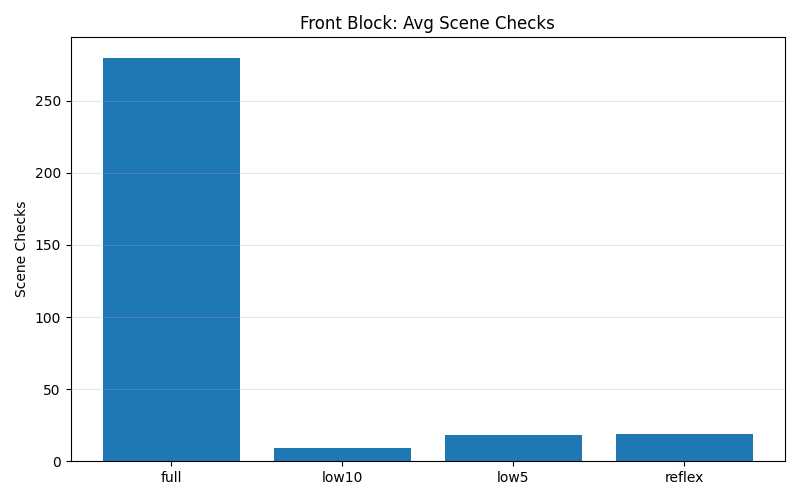
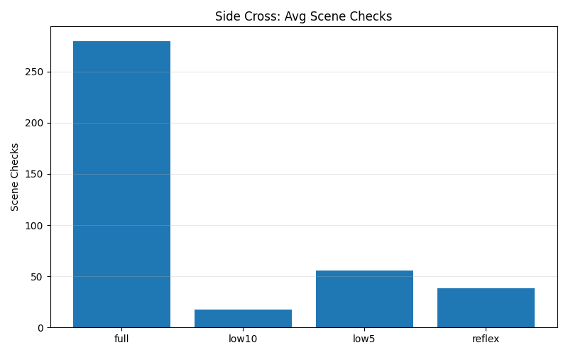
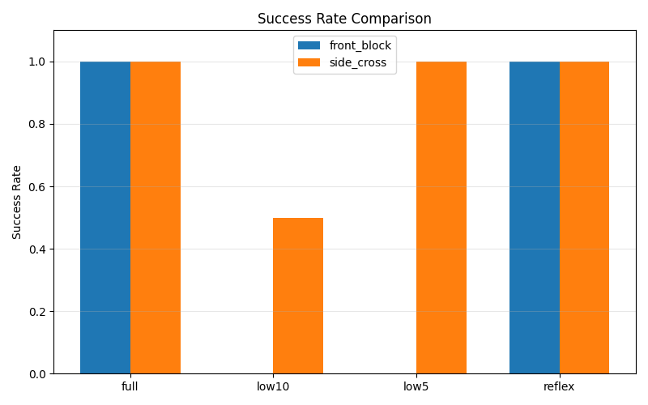
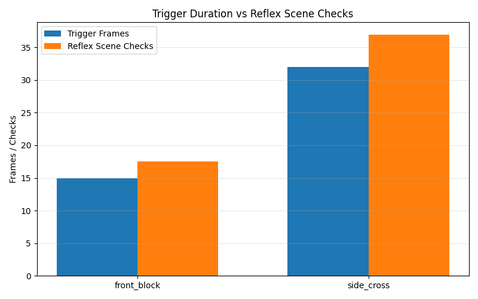

# HRWM — Event-Triggered Perception Prototype (v0.4.x)

Minimal prototype for event-triggered perception routing in dynamic environments

## Overview

We built a minimal runtime prototype to study **event-triggered perception** in dynamic environments.

In two abrupt obstacle scenarios (**front_block** and **side_cross**), a local overlap-triggered routing mechanism:

- Maintains full safety performance
- Reduces scene-level perception checks by up to **10–15×**
- Dynamically escalates sensing only during actual risk exposure

This demonstrates a simple form of **demand-driven perception**, as an alternative to constant-rate sensing.

---

## Core Claim

> Event-triggered perception routing can maintain safety comparable to full perception while reducing scene-level compute by aligning sensing frequency with actual risk exposure duration.

---

## Key Results

### Scene Checks Reduction

- **front_block:** 280 → ~19  
- **side_cross:** 280 → ~37  

### Behavior Comparison

| Mode            | Safety | Compute |
|-----------------|--------|--------|
| full_scene      | ✅     | High   |
| low_freq_10     | ❌     | Low    |
| low_freq_5      | ✅     | Medium |
| reflex_router   | ✅     | Low    |

---

## Insight

The experiments show that perception does not need to operate at a constant rate.

Instead, sensing can be **event-triggered**, scaling with actual environmental risk:

- Short danger window → low compute
- Long danger window → higher compute

This leads to a more efficient **perception-runtime coupling**.

---

## Visualization

### Scene Checks

### Success Rate

### Trigger Duration vs Compute

---

## Files

- `main.py` — simulation runtime
- `frontier_sprint_v0_4_1.md` — full experiment logs and results
- `*.png` — visualization figures

---

## Limitations

- Single obstacle scenarios
- Heuristic trigger (distance-based)
- Scene checks used as compute proxy (not actual FLOPs)

These limitations define the current validation scope rather than weaknesses of the approach.

---

## Why This Matters

Most perception systems run at a fixed rate.

This prototype shows that:

> **Perception can be event-driven, not constant.**

This has implications for:

- Robotics
- Autonomous navigation
- Edge AI systems

---

## Status

This is a **minimal validated prototype** (v0.4.x).

Focus:  
✔ Problem definition  
✔ Structural idea  
✔ Empirical validation  

Not intended as a full system.

---

## Contact / Discussion

Open to discussion, feedback, and collaboration.
